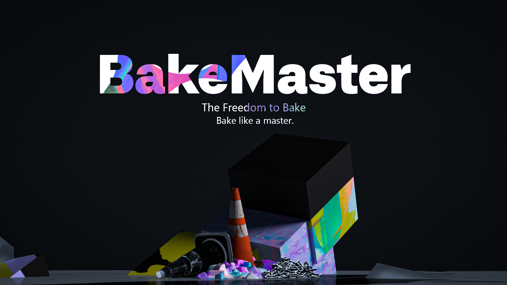

.. BakeMaster Blender Add-on documentation master file, created by
   sphinx-quickstart on Tue Jul 26 16:55:00 2022.
   You can adapt this file completely to your liking, but it should at least
   contain the root `toctree` directive.

==============================
BakeMaster 2.6.3 Documentation
==============================

|teaser|

BakeMaster Blender Baking Addon Documentation will help you learn all the ropes of your ultimate baking workflow with BakeMaster.

About
=====

* :doc:`/pages/about`

.. toctree::
   :hidden:
   :includehidden:

   pages/about.rst

The Setup
=========

* :doc:`/pages/setup/installation`
* :doc:`/pages/setup/interface`

.. toctree::
   :hidden:
   :caption: The Setup
   :maxdepth: 1

   pages/setup/installation
   pages/setup/interface

Getting Started
===============

* :doc:`/pages/start/objects`
* :doc:`/pages/start/maps`
* :doc:`/pages/start/bake`

.. toctree::
   :hidden:
   :caption: Getting Started
   :maxdepth: 1

   pages/start/objects
   pages/start/maps
   pages/start/bake

Advanced
========

* :doc:`/pages/advanced/nolimits`
* :doc:`/pages/advanced/savetime`
* :doc:`/pages/advanced/improve`

.. toctree::
   :hidden:
   :caption: Advanced
   :maxdepth: 1

   pages/advanced/nolimits
   pages/advanced/savetime
   pages/advanced/improve
   
More
====

* :doc:`/pages/more/connect`
* :doc:`/pages/more/releases`

.. toctree::
   :hidden:
   :caption: More
   :maxdepth: 1

   pages/more/connect
   pages/more/releases
