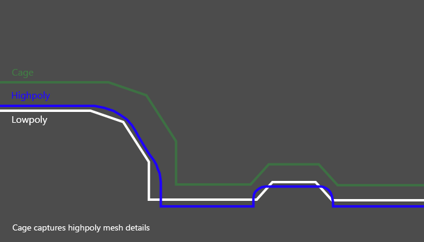

================
Get Best Results
================

Tutorials
=========

.. todo:: Embed a YouTube video tutorial

Baking from highpoly
====================

Texture baking often includes transferring high-resolution mesh details to a low-res model. Models with loads of geometry require more computer power, and details sometimes aren't even noticed in the final production. On the other hand, lowpoly model is easier to handle, and you can bake high-resolution details onto it.

.. todo:: Two images side by side showing wireframe overlap of high and lowpoly geometries.

.. todo:: Two images side by side showing render time for those models and no visual difference.

Read more about how you can set up `High to Lowpoly bake <../start/objects.html#high-to-lowpoly>`__ in BakeMaster.

Understanding Cages
===================

A Cage is an inflated copy of your base lowpoly model. When baking highpoly details onto a low-res mesh, a Cage limits the distance of shot detail-capturing projection rays.

|understandingcage_howcageworks|
    
The Cage should expand far enough to cover all highpoly geometry for best results. Expanding the Cage too far may cause glitches as projection might intersect other meshes in the scene.

.. todo:: Images side by side: 1 - cage not fully covering highpoly - bake glitches, 2 - correct cage - everything is fine.

In BakeMaster, you can choose a Cage object you created or specify the ``Extrusion`` value to inflate the lowpoly.

.. todo:: Gifs side by side: 1 - showing how to specify the extrusion, 2 - how to choose a cage object.

Decrease Baking time
====================

Map resolution
--------------

When choosing a higher map resolution, consider whether it'd be noticeable in the output rendered image, estimate the distance from the camera to that specific model, its relative size in the render, and how many details would be distinguished.

.. todo:: 3 images side by side showing one rendered model having textures baked at different res (4k, 1k, .5k).

What's the best sample count
----------------------------

Baking time also increases when setting the sample count very high. It'll result in cleaner and smoother bakes, but you can keep them pretty low and use `Denoising <./nolimits.html#denoising-maps>`__ later.

AO fragment, how long the bake took:

.. raw:: html

    

        

            
            

                
8 samples, 4k,

                
not denoised, 39s

            

        

        

            
            

                
128 samples, 4k,

                
not denoised, 6m48s

            

        

        

            
            

                
8 samples, 4k,

                
denoised, 1m13s

            

        

    

PBR-Metallic and PBR-Specular
=============================

PBR stands for physically based rendering workflow that uses enhanced lightning and shading techniques to make textured models more realistic and believable. Because all the data isn't in a single image, it reproduces light bounces, reflections, and other microsurface details more accurately. And with global illumination and indirect light sources, it enhances the realism of the scene.

There're two PBR workflows existing: PBR-Metallic and PBR-Specular.

PBR-Metallic
------------

The most used type of PBR texturing is PBR-Metallic, and a wide range of software supports it. PBRM consists of Albedo, Metalness, and Roughness maps. 

1. Albedo holds color data without any light or shadow impact, just the color itself. 
2. Metalness map is a grayscale image describing which parts of a model are metal and which are not. 
3. Roughness is also a grayscale map that carries which parts are rough and which are reflective.

.. raw:: html

    

        

            
            

                
Albedo

            

        

        

            
            

                
Metalness

            

        

        

            
            

                
Roughness

            

        

    

PBR-Specular
------------

This type of workflow is used less widely but is excellent for its ability to represent reflectiveness more precisely. It uses Diffuse, Specular, and Glossiness maps.

1. Similarly to the PBR-Metallic, the Diffuse map stores only color data, without any light or shadow impact, but metallic parts of the model are black on this map, as they have no diffuse color.
2. Specular map determines the color of specular reflections, metallic parts of a model are vibrant and colorful, while non-metallic are grey (``Hex#383838``).
3. Glossiness map is an inverted copy of the Roughness map explained previously. It describes glossy and rough parts of a model.

.. raw:: html

    

        

            
            

                
Diffuse

            

        

        

            
            

                
Specular

            

        

        

            
            

                
Glossiness

            

        

    

The workaround with BakeMaster
------------------------------

Read how you can `bake maps of both workflows <./nolimits.html#pbr-metallic-and-pbr-specular>`__ in BakeMaster.

Help system
===========

The Help panel offers a couple of buttons that will take you to the corresponding pages of BakeMaster's online documentation you're currently reading.

.. raw:: html

    

        

            

                
                

                    
Main Page

                

            

            

                
                

                    
How to Setup Objects

                

            

            

                
                

                    
How to Setup Maps

                

            

            

                
                

                    
How to Bake

                

            

            

                
                

                    
Support

                

            

        

        

            <a class="prev" onclick="slideshow_setSlideByRelativeId('slideshow-0', -1)" onselectstart="return false">&#10094;</a>
            

                
                
                
                
                
            

            <a class="next" onclick="slideshow_setSlideByRelativeId('slideshow-0', 1)" onselectstart="return false">&#10095;</a>
        

    
