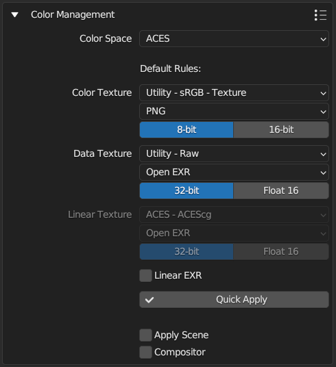

.. |understandingcage_howcageworks| image:: ../../_static/images/pages/advanced/improve/understandingcage_howcageworks_700x400.gif
    :alt: How Cage works

================
Get Best Results
================

Baking from highpoly
====================

Texture baking often includes transferring high-resolution mesh details to a low-res model. Models with loads of geometry require more computer power, and details sometimes aren't even noticed in the final production. On the other hand, lowpoly model is easier to handle, and you can bake high-resolution details onto it.

.. raw:: html

    

        

            
            

                
Lowpoly Geometry

            

        

        

            
            

                
Highpoly Geometry

            

        

    

.. raw:: html

    

        

            
            

                
Rendered Lowpoly,

                
baked textures

            

        

        

            
            

                
Rendered Highpoly,

                
took 60% more time

            

        

    

Read more about how you can set up `High to Lowpoly bake <../start/objects.html#high-to-lowpoly>`__ in BakeMaster.

Understanding Cages
===================

A Cage is an inflated copy of your base lowpoly model. When baking highpoly details onto a low-res mesh, a Cage limits the distance of shot detail-capturing projection rays.

|understandingcage_howcageworks|
    
The Cage should expand far enough to cover all highpoly geometry for best results. Expanding the Cage too far may cause glitches as projection might intersect other meshes in the scene.

.. raw:: html

    

        

            
            

                
Cage not fully covering

                
highpoly and lowpoly

            

        

        

            
            

                
Cage is correct,

                
no issues

            

        

    

In BakeMaster, you can choose a Cage object you created or specify the ``Extrusion`` value to inflate the lowpoly.

.. raw:: html

    

        

            

                
                

                    <b>How to set extrusion</b>
                    
<em>Extrusion</em> - inflate the lowpoly by the specified distance for baking, <em>Max Ray Distance</em> - the max distance of shot rays to capture details, shouldn't be less than extrusion.

                

            

            

                
                

                    <b>How to set a Cage</b>
                    
Choose a Cage Object from the available, you might want to set the Cage Extrusion value to 0, otherwise, the cage will be extruded.

                

            

        

        

            <a class="prev" onclick="slideshow_setSlideByRelativeId('slideshow-1', -1)" onselectstart="return false">&#10094;</a>
            

                
                
            

            <a class="next" onclick="slideshow_setSlideByRelativeId('slideshow-1', 1)" onselectstart="return false">&#10095;</a>
        

    

Decrease Baking time
====================

Map resolution
--------------

When choosing a higher map resolution, consider whether it'd be noticeable in the output rendered image, estimate the distance from the camera to that specific model, its relative size in the render, and how many details would be distinguished.

What's the best sample count
----------------------------

Baking time also increases when setting the sample count very high. It'll result in cleaner and smoother bakes, but you can keep them pretty low and use `Denoising <./nolimits.html#denoising-maps>`__ later.

AO fragment, how long the bake took:

.. raw:: html

    

        

            
            

                
8 samples, 4k,

                
not denoised, 39s

            

        

        

            
            

                
128 samples, 4k,

                
not denoised, 6m48s

            

        

        

            
            

                
8 samples, 4k,

                
denoised, 1m13s

            

        

    

PBR-Metallic and PBR-Specular
=============================

PBR stands for physically based rendering workflow that uses enhanced lightning and shading techniques to make textured models more realistic and believable. Because all the data isn't in a single image, it reproduces light bounces, reflections, and other microsurface details more accurately. And with global illumination and indirect light sources, it enhances the realism of the scene.

There're two PBR workflows existing: PBR-Metallic and PBR-Specular.

PBR-Metallic
------------

The most used type of PBR texturing is PBR-Metallic, and a wide range of software supports it. PBRM consists of Albedo, Metalness, and Roughness maps. 

1. Albedo holds color data without any light or shadow impact, just the color itself. 
2. Metalness map is a grayscale image describing which parts of a model are metal and which are not. 
3. Roughness is also a grayscale map that carries which parts are rough and which are reflective.

.. raw:: html

    

        

            
            

                
Albedo

            

        

        

            
            

                
Metalness

            

        

        

            
            

                
Roughness

            

        

    

PBR-Specular
------------

This type of workflow is used less widely but is excellent for its ability to represent reflectiveness more precisely. It uses Diffuse, Specular, and Glossiness maps.

1. Similarly to the PBR-Metallic, the Diffuse map stores only color data, without any light or shadow impact, but metallic parts of the model are black on this map, as they have no diffuse color.
2. Specular map determines the color of specular reflections, metallic parts of a model are vibrant and colorful, while non-metallic are grey (``Hex#383838``).
3. Glossiness map is an inverted copy of the Roughness map explained previously. It describes glossy and rough parts of a model.

.. raw:: html

    

        

            
            

                
Diffuse

            

        

        

            
            

                
Specular

            

        

        

            
            

                
Glossiness

            

        

    

The workaround with BakeMaster
------------------------------

Read how you can `bake maps of both workflows <./nolimits.html#pbr-metallic-and-pbr-specular>`__ in BakeMaster.

Color Management
=================

Configuring the color management of your bakes is essential to ensure that your textures have the desired color scheme. Color management is indispensable to keep in mind if you create maps for professional or commercial purposes, as color accuracy can be crucial in these contexts. By accessing the Output panel and expanding the Color Management section, you can easily modify the color settings to achieve the desired results.

.. TODO: image with srgb color management

|colormanagement|

.. seealso::
   `Color Management <https://docs.blender.org/manual/en/latest/render/color_management.html>`__ and `Image Color Spaces <https://docs.blender.org/manual/en/latest/render/color_management.html#image-color-spaces>`__ in Blender Manual.

Color Spaces
------------

In order for textures to shade models in a correct and realistic way, their color spaces have to be set up right. This will ensure the data (like color or surface information) is properly read from images and doesn't break further pipelines.

.. attention::
    It's worth noting that BakeMaster officially supports the following color spaces, including:

    1. **sRGB**
    2. **ACES**
    3. **XYZ**

    If you opt to use a different color space, you can still bake, but please bear in mind that you may not have the same level of customization as with the three options mentioned above.

.. TODO: image with default color space

.. raw:: html

    

        

            
            

                
The name of the color space used in your scene will appear at the panel's top

            

        

    

Texture Types
-------------

When it comes to customization, there are three texture types to consider: color texture, data texture, and linear texture.

1. **Color Texture** 
    Includes baked color textures with color data such as Diffuse, Albedo, Base Color, ColorIDs maps, etc. 
2. **Data Texture**
    Refers to baked textures with non-color data such as Normal, Metalness, Roughness, Displacement, AO maps, etc.
3. **Linear Texture**
    For textures with linear color data and is used for EXR file formats if ``Linear EXR`` is checked.

The table below shows the texture category each Map type goes to:

.. cssclass:: table-with-borders

    +-----------------------------+-----------------------------+------------------------------------------------------------------------------------+
    | **Color Texture**           | **Data Texture**            | **Linear Texture**                                                                 |
    +-----------------------------+-----------------------------+------------------------------------------------------------------------------------+
    | AlbedoM                     | Metalness                   | (All from *Data Texture* if ``Linear EXR`` is checked and Map's file format is EXR |
    +-----------------------------+-----------------------------+------------------------------------------------------------------------------------+
    | AlbedoS                     | Roughness                   |                                                                                    |
    +-----------------------------+-----------------------------+------------------------------------------------------------------------------------+
    | Emission/Lightmap           | Specular                    |                                                                                    |
    +-----------------------------+-----------------------------+------------------------------------------------------------------------------------+
    | BSDF Pass (depends on type) | Glossiness                  |                                                                                    |
    +-----------------------------+-----------------------------+------------------------------------------------------------------------------------+
    | Combined                    | Opacity                     |                                                                                    |
    +-----------------------------+-----------------------------+------------------------------------------------------------------------------------+
    | Emit                        | Normal                      |                                                                                    |
    +-----------------------------+-----------------------------+------------------------------------------------------------------------------------+
    | Diffuse                     | Displacement                |                                                                                    |
    +-----------------------------+-----------------------------+------------------------------------------------------------------------------------+
    | Specular (Albedo-Specular)  | Vector Displacement         |                                                                                    |
    +-----------------------------+-----------------------------+------------------------------------------------------------------------------------+
    | Environment                 | Position                    |                                                                                    |
    +-----------------------------+-----------------------------+------------------------------------------------------------------------------------+
    |                             | Decal Pass                  |                                                                                    |
    +-----------------------------+-----------------------------+------------------------------------------------------------------------------------+
    |                             | AO                          |                                                                                    |
    +-----------------------------+-----------------------------+------------------------------------------------------------------------------------+
    |                             | Cavity                      |                                                                                    |
    +-----------------------------+-----------------------------+------------------------------------------------------------------------------------+
    |                             | Curvature                   |                                                                                    |
    +-----------------------------+-----------------------------+------------------------------------------------------------------------------------+
    |                             | Thickness                   |                                                                                    |
    +-----------------------------+-----------------------------+------------------------------------------------------------------------------------+
    |                             | ID                          |                                                                                    |
    +-----------------------------+-----------------------------+------------------------------------------------------------------------------------+
    |                             | Mask                        |                                                                                    |
    +-----------------------------+-----------------------------+------------------------------------------------------------------------------------+
    |                             | XYZ Mask                    |                                                                                    |
    +-----------------------------+-----------------------------+------------------------------------------------------------------------------------+
    |                             | Gradient Mask               |                                                                                    |
    +-----------------------------+-----------------------------+------------------------------------------------------------------------------------+
    |                             | Edge Mask                   |                                                                                    |
    +-----------------------------+-----------------------------+------------------------------------------------------------------------------------+
    |                             | Wireframe Mask              |                                                                                    |
    +-----------------------------+-----------------------------+------------------------------------------------------------------------------------+
    |                             | BSDF Pass (depends on type) |                                                                                    |
    +-----------------------------+-----------------------------+------------------------------------------------------------------------------------+
    |                             | VertexColor Layer           |                                                                                    |
    +-----------------------------+-----------------------------+------------------------------------------------------------------------------------+
    |                             | Ambient Occlusion           |                                                                                    |
    +-----------------------------+-----------------------------+------------------------------------------------------------------------------------+
    |                             | Shadow                      |                                                                                    |
    +-----------------------------+-----------------------------+------------------------------------------------------------------------------------+
    |                             | Normal                      |                                                                                    |
    +-----------------------------+-----------------------------+------------------------------------------------------------------------------------+
    |                             | UV                          |                                                                                    |
    +-----------------------------+-----------------------------+------------------------------------------------------------------------------------+
    |                             | Roughness                   |                                                                                    |
    +-----------------------------+-----------------------------+------------------------------------------------------------------------------------+
    |                             | Glossy                      |                                                                                    |
    +-----------------------------+-----------------------------+------------------------------------------------------------------------------------+
    |                             | Transmission                |                                                                                    |
    +-----------------------------+-----------------------------+------------------------------------------------------------------------------------+

Configuration
-------------

| For each texture type, you can choose default ``Color Space``, ``File Format``, and ``Bit Depth``.
| BakeMaster comes with standard, commonly used configurations, which will suit in most cases. You can also customize it as much as you like for your specific requirements.

.. caution::
    Be careful when making changes and ensure that you have a good understanding of the subject matter before proceeding.

.. TODO: slideshow with settings

sRGB
----

sRGB is Blender's default Display Device and the most wide-spread elsewhere currently. The images you view on the internet and textures you download are highly likely to be in that space.

For sRGB color space, it is recommended to stick to *sRGB* for ``Color Texture`` and *Non-color* for ``Data Texture``. This ensures that color textures are saved and displayed to match how end user sees them on screen; and non-color data textures are treated as is with no color transformation to properly provide mesh or other information.

.. TODO: gallery with color and data textures in srgb

.. admonition:: Advanced - Linear sRGB
    :class: important

    This isn't a very popular format, but sRGB can be also linearized. This means sRGB textures won't have gamma correction applied.

    By enabling this option and choosing a preferable Linear color space for ``Color Texture``, baked textures will look as if they were in Linear, not sRGB color space:
    
    .. TODO: gallery with comparison

ACES
----

The Academy Color Encoding System (ACES) is a standardized and comprehensive color management tool that simplifies the process of managing colors during production. It is designed to handle various input sources such as film and computer graphics, and it guarantees consistency and reliability throughout the production process. When images are converted to the ACES standard, teams can work together seamlessly, regardless of the source of the images, and attain consistent and predictable color results. The ACES system provides a dependable workspace for artists, who can now concentrate on their creative work without worrying about technical issues or color inconsistencies.

.. TODO: comparison between filmic and aces

This documentation does not cover all the aspects and principles of ACES. Instead, it offers a practical approach to setting up BakeMaster for texture baking in the ACES color space. This way, you can avoid going in circles and achieve your desired results efficiently.

.. TODO: aces logo and gamut

.. seealso::
   `Blender Support for ACES <https://devtalk.blender.org/t/blender-support-for-aces-academy-color-encoding-system/13972>`__. `Introduction to ACES <https://acescolorspace.com/>`__. `Sony Pictures Imageworks Color Pipeline <https://opencolorio.readthedocs.io/en/latest/concepts/overview/overview.html#sony-pictures-imageworks-color-pipeline>`__.

.. admonition:: BakeMaster and ACES
    :class: important

    By default, ACES is set up in BakeMaster to bake Color Textures in sRGB and Data Textures in Raw:

    1. Color Texture -> ``Utility - sRGB - Texture``
    2. Data Texture -> ``Utility - Raw``

    If you yearn for getting the most out of ACES, switch Color Texture's color space to ``ACES - ACEScg``. As a result, color textures will be linear, and the baked data from Blender is stored directly (apart from ACES - ACES2065 -> ACES - ACEScg conversion. ACES2065 is primarily used for archiving and interchange, whereas ACEScg is intended to be used for CG, rendering and compositing).

    To bake ACES-compliant textures in ACEScg IDT/ODT, make the following changes:

    1. Color Texture: ``ACES - ACEScg`` color space, ``16-bit`` bit depth, ``EXR`` or ``TIFF`` file format.
    2. Data Texture: ``Utility - Raw`` color space, half-float ``Float 16`` bit depth, ``EXR`` file format.

    .. TODO: gallery: one - aces somewhat like srgb; second - good aces setup, note that it's an example

Scene's and Compositor's effect
-------------------------------

.. admonition:: Scene Color Management
    :class: important

    If you want your scene color management settings to be applied to bakes, ``Apply Scene`` is the way. By turning it on, you can, for example, add Filmic view transform to baked textures if the scene has got one and other settings like Exposure, Gamma, Curves configured in the *Properties -> Color Management*.

    .. TODO: gallery with comparison

.. admonition:: Compositor Nodes
    :class: important

    Ticking ``Compositor`` will run bakes through compositor nodes. This is helpful when you've got additional color management set up in compositor (e.g. custom color adjustments, etc.) and want it to affect baked images.

In Short
--------

.. admonition:: Default Rules
    :class: note

    Use to set default ``Color Space``, ``File Format``, and ``Bit Depth`` for baked images. You're most likely to tweak the last two. Be careful when changing the color space.

.. admonition:: Apply Settings
    :class: note

    | Preferences get applied to new Maps that you're adding.
    | To update existing, click ``Quick Apply`` button.

.. admonition:: Apply Scene or/and Compositor
    :class: note

    | Tick ``Apply Scene`` to apply View Transform, Exposure, Gamma, and Curves to your bakes.
    | Tick ``Compositor`` to make BakeMaster run textures through color management in compositor nodes.

.. admonition:: View Image Color Space
    :class: note

    View image color space in the Image/UV Editor:

    1. Select an image
    2. Hit ``N`` on your keyboard to open properties
    3. Open ``Image`` tab
    4. Look at the ``Color Space`` property under the filepath.

    .. TODO: image color space property image

Help system
===========

The Help panel offers a couple of buttons that will take you to the corresponding pages of BakeMaster's online documentation you're currently reading.

.. raw:: html

    

        

            

                
                

                    
Main Page

                

            

            

                
                

                    
How to Setup Objects

                

            

            

                
                

                    
How to Setup Maps

                

            

            

                
                

                    
How to Bake

                

            

            

                
                

                    
Support

                

            

        

        

            <a class="prev" onclick="slideshow_setSlideByRelativeId('slideshow-0', -1)" onselectstart="return false">&#10094;</a>
            

                
                
                
                
                
            

            <a class="next" onclick="slideshow_setSlideByRelativeId('slideshow-0', 1)" onselectstart="return false">&#10095;</a>
        

    

