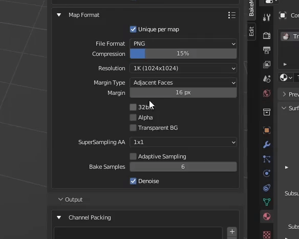

=========
No Limits
=========

Denoising Maps
==============

Baking with a low sample count might result in image noise. Enable denoising (noise reduction) in the map's `Format Settings <../start/maps.html#format-settings>`__.

.. raw:: html

    

        

            
            

                
AO fragment,

                
not denoised

            

        

        

            
            

                
AO fragment,

                
denoised

            

        

    

.. caution:: 
    It may not be a good idea to denoise maps like Normal because might blur out some important details.

    It's recommended to avoid using it with other maps like Albedo when colors have sharp details and you want to preserve them. You can always add two similar maps and stick with the one that looks the best.

.. raw:: html

    

        

            
            

                
Albedo fragment,

                
not denoised

            

        

        

            
            

                
Albedo fragment,

                
denoised

            

        

    

.. seealso:: 
    `Comparison between denoised/not denoised bakes <../advanced/improve.html#what-s-the-best-sample-count>`__ and how much time they took to bake.

Supersample anti-aliasing
=========================

With SSAA, BakeMaster bakes at a higher resolution and then downscales back to the chosen map resolution. Such technique smoothes out very contrasted edges and makes images jaggy-free. Enable SSAA in the map's `Format Settings <../start/maps.html#format-settings>`__.

.. raw:: html

    

        

            
            

                
1K (1024x1024)

                
No SSAA

                
Took 1s to bake

            

        

        

            
            

                
1K (1024x1024)

                
2x2 SSAA

                
Took 3s to bake

            

        

        

            
            

                
1K (1024x1024)

                
8x8 SSAA

                
Took 4m to bake

            

        

    

.. note::
   SSAA increases the bake time as if you were to manually increase the resolution.

Channel Packing
===============

Channel Packing is commonly used in the Game Dev industry when there's a need to pack baked maps into image color channels to save memory usage. For example, you can have a single image file baked, where the Red channel holds Metalness, the Green carries Roughness, and the Blue one - AO.

.. raw:: html

    

        

            
            

                
Metalness

            

        

        

            
            

                
Roughness

            

        

        

            
            

                
AO

            

        

    

.. raw:: html

    

        

            
            

                
Channel Packed

                
Metalness, Roughness, AO

                
R+G+B

            

        

    

With BakeMaster, you can easily configure Channel Packs and have any maps packed.

|howtochannelpack|

.. admonition:: Channel Pack type
    :class: important

    Imagine having Channel Pack types, with which you can pack not only in the ``R+G+B`` way but also ``RGB+A`` or ``R+G+B+A``. BakeMaster allows you to do even that.

    .. raw:: html

        

            

                

                    
                    

                        <b>R+G+B+A</b>
                    

                

                

                    
                    

                        <b>RGB+A</b>
                    

                

                

                    
                    

                        <b>R+G+B</b>
                    

                

            

            

                <a class="prev" onclick="slideshow_setSlideByRelativeId('slideshow-0', -1)" onselectstart="return false">&#10094;</a>
                

                    
                    
                    
                

                <a class="next" onclick="slideshow_setSlideByRelativeId('slideshow-0', 1)" onselectstart="return false">&#10095;</a>
            

        

Texture Sets
============

A Texture Set is a set of images baked for one object. By default, BakeMaster will save baked maps for each object into separate Texture Sets. Meaning there will be sets of image files for each object. In some cases, you might want, for example, an Albedo map for ten objects baked onto a single image file. BakeMaster allows doing so and even with automatic UV Repack if needed.

.. raw:: html

    

        

            
            

                
Object1, not in a Texture Set

            

        

        

            
            

                
Object2, not in a Texture Set

            

        

        

            
            

                
Object3, not in a Texture Set

            

        

    

.. raw:: html

    

        

            
            

                
All objects in one Texture Set

            

        

    

Follow the instruction below, If you want some objects to share the same Texture Set.

|howtotexset|

PBR-Metallic and PBR-Specular
=============================

Blender supports only PBR-Metallic workflow, but BakeMaster can bake both PBRS and PBRM types. It'll correctly recalculate the Metallic workflow used in your materials, giving a clear and clean PBRS output, and then restore all materials back after baking. You can add both PBR-Specular and PBR-Metallic maps to the Table of Maps.

PBR-Metallic:

.. raw:: html

    

        

            
            

                
AlbedoM

            

        

        

            
            

                
Metalness

            

        

        

            
            

                
Roughness

            

        

    

PBR-Specular:

.. raw:: html

    

        

            
            

                
AlbedoS

            

        

        

            
            

                
Specular

            

        

        

            
            

                
Glossiness

            

        

    

| The examples of PBRS and PBRM bakes shown above were baked with BakeMaster.
| `(more about PBR-Metallic and PBR-Specular workflows) <./improve.html#pbr-metallic-and-pbr-specular>`__

.. admonition:: How BakeMaster names maps of both workflows
    :class: important

    | PBR-Metallic: ``AlbedoM``, ``Metalness``, ``Roughness``;
    | PBR-Specular: ``AlbedoS``, ``Specular``, ``Glossiness``.

    You can always specify your custom map naming in the ``Prefix`` field of the `Map Settings area <../start/maps.html#map-settings>`__.

Create a Bake Job Group
=======================

You can create a new Container and choose objects to put in it. That will act as a Bake Job. With Bake Jobs, you can choose maps and set identical settings for all objects in them at once. Follow the slideshow below to build one up:

|howtobakejob|

.. caution:: 
    | Only objects not in Containers already can form a new Bake Job Container.
    | Read more about `Containers <./nolimits.html#containers>`__ in BakeMaster.

Visibility Groups
=================

Objects in a single Visibility Group might cause an effect on each other when baking (where meshes intersect). That can result in intersection errors or cage glitches.

.. raw:: html

    

        

            
            

                
Normal Map, flat area,

                
intersection caused by mesh overlapping

            

        

        

            
            

                
Normal Map, flat area,

                
no issues

            

        

    

1. You can fix this by enabling the ``Hide when Inactive`` option in the object's Bake Output panel.

2. Or by putting objects that shouldn't affect others into separate Visibility Groups.

.. raw:: html

    

        

            

                
                

                    <b>Hide when inactive</b>
                    
If checked, Object's Mesh will not affect any other Objects while baking.

                

            

            

                
                

                    <b>VG Index</b>
                    
Object's Mesh will affect other objects' meshes if their Visibility Group Indexes are equal to the same value. The effect is noticeable in areas where meshes intersect.

                

            

        

        

            <a class="prev" onclick="slideshow_setSlideByRelativeId('slideshow-3', -1)" onselectstart="return false">&#10094;</a>
            

                
                
            

            <a class="next" onclick="slideshow_setSlideByRelativeId('slideshow-3', 1)" onselectstart="return false">&#10095;</a>
        

    

Batch Name Preview
==================

| BakeMaster allows you to customize the naming pattern of the output filenames in the ``Batch Name`` field in the object's Bake Output panel. That gives a lot of control over output image naming. But sometimes, it's hard to get an idea of what the filename will be.
| Luckily, there's the ``Preview Batch Name`` operator that can do just that!

|batchnamepreview|

Match Resolution
================

If you have image textures in the object's materials and want to bake maps with similar resolutions, check out the ``Match Resolution`` operator.

|matchres|

Containers
==========

A Container holds a group of objects that can share the same settings. It can consist of Lowpolies, Highpolies, and Cages Subcontainers that carry objects of their corresponding type.

Containers become available when `Name Matching <../start/objects.html#name-matching>`__ is enabled.

.. admonition:: Additional features
    :class: important

    You can expand/collapse formed containers and rename them to your liking.

    |containers|

    | A Container can share the same settings for all its objects.
    | For this, toggle the ``Global`` option for the Container.

        .. raw:: html

            

                

                    

                        
                        

                            <b>Not Global</b>
                            
Container is just a holder for objects.

                        

                    

                    

                        
                        

                            <b>Global</b>
                            
All Container's objects inherit its settings.

                        

                    

                

                

                    <a class="prev" onclick="slideshow_setSlideByRelativeId('slideshow-1', -1)" onselectstart="return false">&#10094;</a>
                    

                        
                        
                    

                    <a class="next" onclick="slideshow_setSlideByRelativeId('slideshow-1', 1)" onselectstart="return false">&#10095;</a>
                

            

Addon Preferences
=================

Some influential settings sit in the addon preferences.

|openaddonprefs|
   
.. raw:: html

    

        

            

                
                

                    <b>Lowpoly Tag</b>
                    
What keyword to search for in the object's name to determine if it's a Lowpoly Object.

                

            

            

                
                

                    <b>Highpoly Tag</b>
                    
What keyword to search for in the object's name to determine if it's a Highpoly Object.

                

            

            

                
                

                    <b>Cage Tag</b>
                    
What keyword to search for in the object's name to determine if it's a Cage Object.

                

            

            

                
                

                    <b>Decal Tag</b>
                    
What keyword to search for in the object's name to determine if it's a Decal Object.

                

            

            

                
                

                    <b>UVMap Tag</b>
                    
What UVMap name should include for BakeMaster to see it as UVMap for bake. UVMaps with that value in their names will have a higher priority in the Active UVMap setting.

                

            

            

                
                

                    <b>Hide not baked</b>
                    
Hide all Objects in the scene that are not proceeded in the bake, so that they do not affect it.

                

            

            

                
                

                    <b>Maps Match Type</b>
                    
When baking with Texture Sets, this will specify how to determine what maps should be baked onto the same image files. <em>Maps Prefixes</em> - default, match by maps' prefixes, <em>Maps Types</em> - match by maps' types, <em>Both</em> - match maps by both their prefixes and types.

                

            

            

                
                

                    <b>Addon Location</b>
                    
Where the addon is located.

                

            

            

                
                

                    <b>Addon Version</b>
                    
BakeMaster version you're using.

                

            

        

        

            <a class="prev" onclick="slideshow_setSlideByRelativeId('slideshow-2', -1)" onselectstart="return false">&#10094;</a>
            

                
                
                
                
                
                
                
                
                
            

            <a class="next" onclick="slideshow_setSlideByRelativeId('slideshow-2', 1)" onselectstart="return false">&#10095;</a>
        

    

