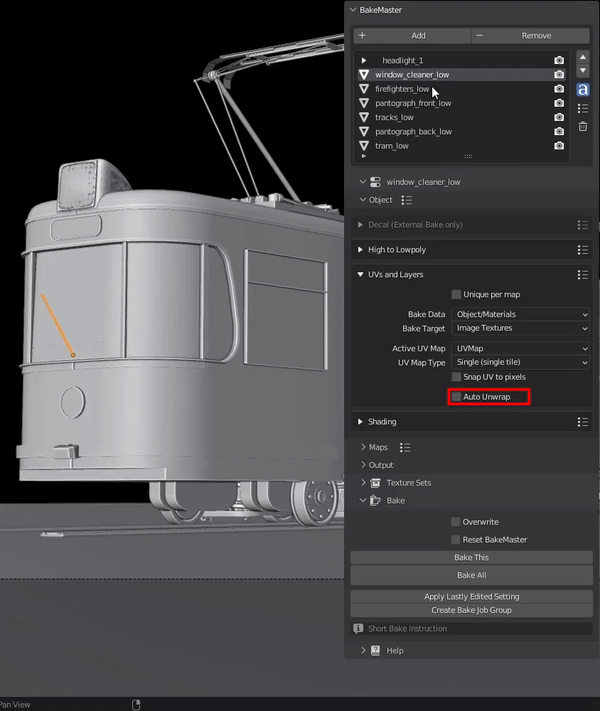
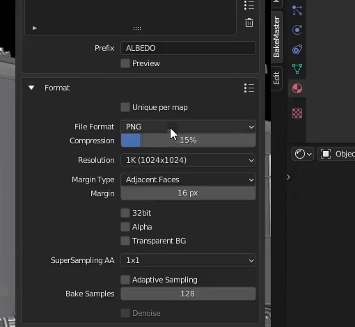

=========
Save Time
=========

Presets
=======

BakeMaster allows saving Settings Presets for everything.

Simple Presets
--------------

Save the settings of any addon's panel.

|simplepresets|

.. raw:: html

    

        

            

                
                

                    <b>Full Maps Preset</b>
                    
This preset will remove all current maps and add saved maps to the table with their settings. You can save, for example, 5 maps that you always bake fully configured and save time not adding them one by one.

                

            

            

                
                

                    <b>Map Preset</b>
                    
This preset will save and load settings only for the current active map in the table.

                

            

        

        

            <a class="prev" onclick="slideshow_setSlideByRelativeId('slideshow-0', -1)" onselectstart="return false">&#10094;</a>
            

                
                
            

            <a class="next" onclick="slideshow_setSlideByRelativeId('slideshow-0', 1)" onselectstart="return false">&#10095;</a>
        

    

Advanced Presets
----------------

.. todo:: Image showing how to access the Full Object Preset.

**Full Object Preset** can load all settings at once for one object, or the ones you specified.

.. todo:: Slideshow of gifs showing full object preset's execution controls.

Apply Lastly Edited Setting
===========================

Sometimes, you can have many maps or objects, and there's one specific setting you need to be similar. It's always possible to click a couple of times to set it, but BakeMaster has a cool feature to save you time: ``Apply Lastly Edited Setting`` located in the Bake panel.

|howalepworks|