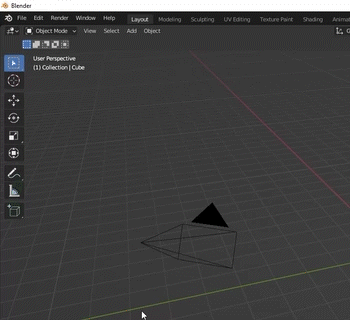
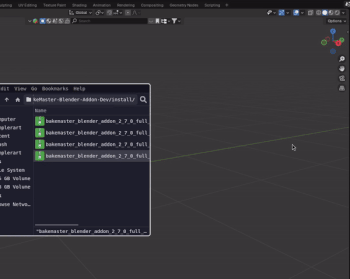

.. |download_blender| image:: https://download.blender.org/branding/blender_logo.png
    :target: https://www.blender.org/download/
    :width: 200 px
    :alt: Download Blender

.. |install| image:: ../../_static/images/pages/setup/installation/install_350x320.gif
    :alt: Install

============
Installation
============

| BakeMaster is a Blender addon, so if you haven't got the software on your device yet, `go ahead <https://blender.org/download/>`__.
| Make sure the Blender version you use is `compatible with BakeMaster <./compatibility.html>`__.

|download_blender|

Download BakeMaster
===================

Download the latest BakeMaster addon version from the `Blender Market <https://blendermarket.com/products/bakemaster>`__ or `Gumroad <https://kemplerart.gumroad.com/l/bakemaster>`__.

If you use Blender 4.2 and higher, you can now drag the downloaded zip into an opened Blender window and follow the instructions in a popover. That is it for the installation process for Blender 4.2 onward.

|install_42|

Go to your Blender Preferences and install the downloaded zipped folder.

1. Open Blender
2. Go to ``Edit`` > ``Preferences`` > ``Add-ons``
3. Click ``Install``
4. Choose the downloaded zipped folder
5. Enable the addon

|install|

.. admonition:: Uninstall previous versions
    :class: caution

    | If you have a previous version of BakeMaster running, make sure you uninstall it first:
    | (Restart Blender after for changes to take effect)

    |remove|

.. admonition:: Install the latest version
    :class: seealso

    It is recommended to install the latest BakeMaster version, as it delivers more stability, improvements, and features.

.. admonition:: Demo Version
    :class: seealso

    The Demo version includes an overlook of the addon's interface. You can also download it from the `GitHub repo <https://github.com/KirilStrezikozin/BakeMaster-Blender-Addon>`__. Go to the ``install/`` directory and download the zip. For the max experience, install the Full Version.

If you have any issues with installing the addon, feel free to `reach out for help <../more/connect.html>`__.
