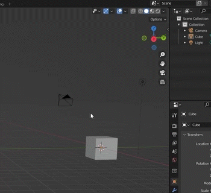

=========
Interface
=========

Access BakeMaster in Blender
============================

BakeMaster can be accessed in the ``3D Viewport``. Hit the ``N`` key on your keyboard and you'll see the side menu pop up on the right. Head over to the addon's panel called ``BakeMaster``.

|access|

Addon's Interface
=================

.. todo::
    Slideshow of images showing all addon's panels.
