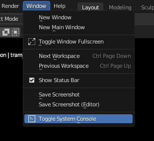
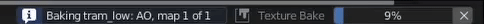

========
Hit Bake
========

Start the Bake
==============

.. raw:: html

    

        

            

                
                

                    <b>Overwrite</b>
                    
If checked, old bake files in the output directory will be overwritten by the new ones if they have the same name.

                

            

            

                
                

                    <b>Reset BakeMaster</b>
                    
Remove baked objects from BakeMaster Table of Objects after the bake.

                

            

            

                
                

                    <b>Bake This</b>
                    
Bake maps only for the current object or container.

                

            

            

                
                

                    <b>Bake All</b>
                    
Bake maps for all objects added.

                

            

            

                
                

                    <b>Apply Lastly Edited Setting</b><a href="../advanced/savetime.html#apply-lastly-edited-setting"> (read more)</a>
                    
Select maps or objects to apply value of lastly edited property for.

                

            

            

                
                

                   <b>Create Bake Job Group</b><a href="../advanced/nolimits.html#create-a-bake-job-group"> (read more)</a>
                    
Group objects into a Bake Job Container, where all settings can be set at once for all.

                

            

            

                
                

                    <b>Bake Instruction</b><a href="./bake.html#while-waiting"> (read more)</a>
                    
Short Bake Instruction.

                

            

        

        

            <a class="prev" onclick="slideshow_setSlideByRelativeId('slideshow-0', -1)" onselectstart="return false">&#10094;</a>
            

                
                
                
                
                
                
                
            

            <a class="next" onclick="slideshow_setSlideByRelativeId('slideshow-0', 1)" onselectstart="return false">&#10095;</a>
        

    

BakeMaster Bake won't block anything, so you can continue creating while it's doing its magic.

While waiting
=============

|bake_progress|

Control the baking process from your keyboard or Blender Console. All keybindings are present below and under the ``Bake Instruction`` field in the Bake panel.

.. cssclass:: ul-stylized

    * Press ``BACKSPACE`` to cancel baking all next maps
    * Press ``ESC`` key to cancel baking the current map
    * Press ``BACKSPACE``, ``ESC`` to cancel baking

.. admonition:: Tip: Blender Console
    :class: important

    By opening the Blender Console you'll see more precise bake process feedback and be able to press ``Ctrl + C`` or ``⌘ Cmd + C`` (Mac) to abort the bake.

    |open_blender_console|

.. caution:: 
    Blender freezes are expected when handling meshes with large amounts of geometry, baking map results to modifiers, Denoising baked results, or UV unwrapping and packing. Please be patient, BakeMaster will notify you if any error occurs.