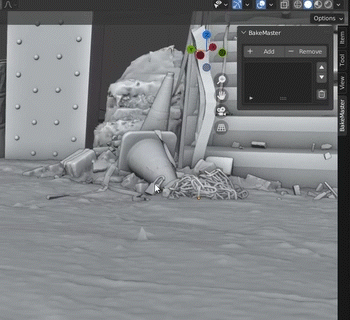
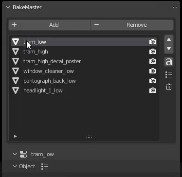

=============
Setup Objects
=============

Choose Objects
==============

To start settings up maps (image textures) for the mesh objects you want to bake, add these objects to the Table of Objects. Do it by pressing the ``Add`` button on the top:

|add_objects|

.. admonition:: Add Highpolies and Cages too
    :class: caution

    If you have highpolies or cages beside lowpoly models, add them to the Table too.

Name Matching
=============

| BakeMaster can automatically match all your lowpolies, highpolies, and cages with each other.
| To do so, press the ``ɑ`` button (`Containers <../advanced/nolimits.html#containers>`__ will form):

|how_nm_works|

Naming Conventions
------------------

| Objects get matched by the following suffixes:
| (can be customized in the `Addon Preferences <../advanced/nolimits.html#addon-preferences>`__)

.. cssclass:: table-with-borders

    +------------------------+----------+----------+----------+-----------+
    |                        | Lowpoly  | Highpoly | Cage     | Decal     |
    +------------------------+----------+----------+----------+-----------+
    | Default suffix         | ``low``  | ``high`` | ``cage`` | ``decal`` |
    +------------------------+----------+----------+----------+-----------+

.. cssclass:: table-with-borders

    +-----------------------------+------------------------------+
    | Lowpoly name example        | Gets matched to              |
    +-----------------------------+------------------------------+
    | ``tram_low``                | | ``tram_high``              |
    |                             | | ``tram_cage``              |
    |                             | | ``tram_high_decal``        |
    +-----------------------------+------------------------------+
    | ``Headlight_low_1``         | | ``Headlight_high_1``       |
    |                             | | ``Headlight_cage_1``       |
    +-----------------------------+------------------------------+
    | ``Headlight-back_low_55``   | | ``Headlight-back_high_55`` |
    |                             | | ``Headlight-back_cage_55`` |
    +-----------------------------+------------------------------+
    | ``monster_body``            | *Won't get matched*          |
    +-----------------------------+------------------------------+

.. caution::
    | BakeMaster determines naming suffixes between ``_`` (underscores) in the Object name.
    | Unmatched objects won't be grouped into containers.

Additional Controls
===================

The Table of Objects provides additional controls for the Objects in it:

.. raw:: html

    

        

            

                
                

                    <b>Add</b>
                    
Add selected mesh objects in the scene to the table.

                

            

            

                
                

                    <b>Remove</b>
                    
Remove the active object from the table.

                

            

            

                
                

                    <b>Move Up</b>
                    
Move the object's bake priority up.

                

            

            

                
                

                    <b>Mode Down</b>
                    
Move the object's bake priority down.

                

            

            

                
                

                    <b>Name Matching</b><a href="./objects.html#name-matching"> (read more)</a>
                    
Toggle Name Matching.

                

            

            

                
                

                    <b>Full Object Preset</b><a href="../advanced/savetime.html#advanced-presets"> (read more)</a>
                    
Save or load the Full Object Preset.

                

            

            

                
                

                    <b>Trash</b>
                    
Remove all objects from the table.

                

            

            

                
                

                    <b>Active Object</b>
                    
To configure an object, select it in the table. Containers can be collapsed/expanded.

                

            

            

                
                

                    <b>Bake visibility</b>
                    
Toggle include/exclude the object from baking.

                

            

            

                
                

                    <b>Objects' types</b>
                    
Lowpoly, Highpoly, Cage, Decal, Container, or just a simple object have unique icons.

                

            

            

                
                

                    
Make the table wider or less.

                

            

        

        

            <a class="prev" onclick="slideshow_setSlideByRelativeId('slideshow-0', -1)" onselectstart="return false">&#10094;</a>
            

                
                
                
                
                
                
                
                
                
                
                
            

            <a class="next" onclick="slideshow_setSlideByRelativeId('slideshow-0', 1)" onselectstart="return false">&#10095;</a>
        

    

Object settings
===============

Select the object in the Table of Objects to configure its settings.

High to Lowpoly
---------------

Mind this section if you plan to bake from high to lowpoly meshes.

.. todo:: Slideshow of gifs showing settings.

UVs and Layers
--------------

Configure crucial UV and other settings for the object.

.. todo:: Slideshow of gifs showing settings.

Shading Correction
------------------

Let BakeMaster save you time with important mesh normals and shading correction.

.. todo:: Slideshow of gifs showing settings.

Decal Object
------------

Configure Decal Object baking.

.. todo:: Slideshow of gifs showing settings.

Bake Output
-----------

Specify how you want to output the baked result.

.. todo:: Slideshow of gifs showing settings.
